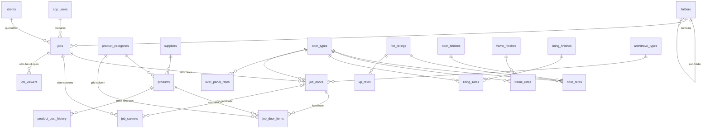

# Door Scheduler V2: Data Model

**Status:** DRAFT for sign-off · **Date:** 2026-09-24 · Implements [v2-functional-spec.md](v2-functional-spec.md) (doors side; ironmongery phase 2; door screens structure only)

The database is **PostgreSQL**. It is built and tested **locally only**; nothing is on Firebase yet. Once you sign it off, the same tables go to a new, separate V2 Firebase project via Data Connect (see [§7](#7-moving-to-firebase-data-connect-after-sign-off)).

| What | Where |
|---|---|
| Tables, rules, triggers | [`db/migrations/`](../db/migrations) (001 to 008, run in order) |
| Starting data (V1 default rates, lists, T&Cs) | [`db/seed.sql`](../db/seed.sql) |
| Dev/test sample jobs (never live) | [`db/sample_data.sql`](../db/sample_data.sql) |
| The queries the app will run | [`db/queries/`](../db/queries) |
| Automated tests (108 checks) | [`db/tests/`](../db/tests), run with `db/test.sh` |

---

## 1. Diagram



## 2. Tables

### Users and settings
| Table | Holds | Notes |
|---|---|---|
| `app_users` | Firebase uid, email, name, **role** (admin / estimator / viewer; not enforced yet) | Email **must** end `@matrixhardware.co.uk`, enforced by the database as well as sign-in |
| `user_preferences` | Per-user column order, hidden columns, density | Replaces browser localStorage |
| `settings` | Default markup (22%), quote ref prefix, **lining depth threshold (150 mm)**, T&Cs, PDF footer | Admin-editable; T&Cs no longer hard-coded |

### Lists and rates (were hard-coded or a single shared document in V1)
| Table | One row per | Notes |
|---|---|---|
| `fire_ratings` | NFR, FD30, FD30S, FD60, FD60S | `base_code`: FD30S uses FD30 prices unless it has its own row (fixes V1 bug 14) |
| `handings`, `over_panel_types` | list value | |
| `door_finishes` | Primed, Laminate, Veneer, Spray | Spray has `base_finish_code = PRIMED`, so its rate is an **uplift** on primed, as in V1 |
| `frame_finishes`, `lining_finishes` | finish | Lining finish list is a starting guess, *to confirm* |
| `door_types` | SASL / SALH / SADL … | `needs_flush_bolts` drives the V1 warning |
| `architrave_types` | Primed, Spray, Bespoke, TBC | Flat price; "none" = blank on the door |
| `door_rates` | door type × fire rating × finish | |
| `vp_rates` | fire rating | Price per vision panel + glass description |
| `frame_rates` | door type × frame finish | |
| `lining_rates` | door type × lining finish | Base price, *to confirm*. **No lining prices are seeded yet** |
| `over_panel_rates` | door type × fire × panel type × finish | V1 only priced laminate; the pricing engine keeps V1's "fall back to laminate" |

Every price is its **own row**, so two admins editing different prices never clash.

### Catalogue
| Table | Holds | Notes |
|---|---|---|
| `suppliers` | name, account code, contact | |
| `product_categories` | Hinges, Closers, … (the 16 V1 categories) | `door_field_key` is the grid/import column, so categories are data, not code. Holds the **default product + qty** for new doors |
| `products` | **MAT code**, supplier code, description, finish, unit, **cost**, active, verified | MAT code unique, stored upper-case. A product can't be *verified* without a MAT code. **Quantity is not part of the product** |
| `product_cost_history` | old cost → new cost, who, when | Written automatically on every cost change |
| `mat_code_registry` | every MAT code in use and which row owns it | Makes MAT codes unique across products **and** all rate tables |

### Jobs
| Table | Holds | Notes |
|---|---|---|
| `clients` | shared address book | Replaces the per-browser V1 list |
| `folders` | nested folders | Can't be moved inside itself |
| `jobs` | **quote ref** (`MH-2026-0001`, automatic, sequential per year), project, client + contact as quoted, markup, status, folder, **prepared by** | Soft delete (`deleted_at`). **No rates copied into the job** |
| `job_doors` | one row per schedule line: qty, mark, location, type or manual, sizes, handing, fire, VPs, finish, **surround (frame / lining / none)**, frame or lining finish, **lining depth + lining uplift**, architrave, over panel, uplift, sell override, complete, comments | Plus the **price snapshot**: `cost_door`, `cost_vp`, `cost_surround`, `cost_architrave`, `cost_over_panel` |
| `job_door_items` | hardware on a door: category, product, **qty**, snapshot of cost / MAT code / description | Phase 1: one product per category per door (the V1 grid columns). Phase 2 lifts this to allow the full ironmongery schedule |
| `job_screens` | **door screens** (structure only): qty, mark, location, sizes, fire, glazing, frame finish, description, manual cost, sell override | Included in job totals |
| `job_viewers` | who has a job open, last seen | Replaces the V1 edit lock |
| `quote_counters` | last quote number per year | Used by the quote-ref trigger |
| `audit_log` | every insert / update / delete on shared data: who, when, before, after | |

## 3. How conflicts are prevented (spec §9)

1. **Everything is saved in small pieces.** One door line, one product or one rate row at a time, never "the whole job" or "all the rates".
2. **Every row has a `version`** that goes up by 1 on every save (automatic, by trigger).
3. **Saves say which version they started from:** `UPDATE … WHERE id = ? AND version = ?` ([example](../db/queries/update_door_field.sql)). If someone else saved that same row first, nothing is updated. The app then shows *"Sam changed door D01: keep mine / take theirs"*. Nothing is silently lost.
4. Editing doors does **not** change the job header's version, so editing the job name while a colleague edits doors is not a conflict.

The tests cover this exactly: two estimators on different doors both save; a stale save on the same door is rejected, and the first save survives.

## 4. How prices and totals work

- **The pricing engine** (Step 2, TypeScript) looks up the rates for a door and saves the answer on the line as the **snapshot** (`cost_door`, `cost_vp`, …). Hardware snapshots are copied from the catalogue automatically when a product is added or swapped.
- **The database does the adding up**, in views, so every screen gets the same answer:
  - unit cost = door + VPs + frame or lining + architrave + over panel + hardware (qty × cost) + uplift + lining uplift
  - line cost = unit cost × qty
  - line sell = sell override × qty, **or** round(line cost × (1 + markup), 2). This is **exactly V1's rule**, including rounding on the line.
  - `v_job_totals`: rows, doors, screens, total cost, total sell, margin %, number of linings missing their uplift
  - `v_jobs`: live jobs with totals and age; used by the job list and dashboard
- **Prices rising in the catalogue don't change old quotes.** "Reprice to current rates" first shows a preview of the changes ([preview](../db/queries/reprice_job_hardware_preview.sql)), then applies them.
- **Linings:** if a lining door's depth is over `settings.lining_depth_threshold_mm` and it has no lining uplift, the line is flagged (`needs_lining_uplift`). The app asks for the uplift, and the PDF is blocked until it's entered. The threshold is **150 mm** (linings up to 150 mm are standard; 151 mm or more asks for the uplift).

The sample job's totals were worked out by hand from the V1 rates. The tests confirm V2 gets the same figures: D01 unit £913.63 → sell £3,343.89; job total sell £5,576.11.

## 4a. MAT codes (filled in by Matrix)

- **Every priced item has an optional MAT code:** products, and every door, vision panel, frame, lining, architrave and over panel rate row.
- **One list to fill them in** (`v_mat_code_table`, [query](../db/queries/mat_code_table.sql)): every priced item described in words (e.g. *Door SASL SINGLE ACTION SINGLE LEAF / FD30 / Laminate*), with its current MAT code and cost. It works like a spreadsheet:
  - Items **without a code come first**.
  - It can be filtered by kind (product, door, frame…), limited to "missing only", and searched.
- **Saving a code** ([query](../db/queries/set_mat_code.sql)):
  - Each code saves on its own with the usual version check, so two people can fill codes in at the same time.
  - Codes are trimmed and upper-cased.
  - A code can only be used **once across everything**; the database refuses a duplicate and says where it's already used.
- **Door lines keep the MAT codes they were priced with** (`mat_code_door`, `mat_code_vp`, `mat_code_surround`, `mat_code_architrave`, `mat_code_over_panel`), next to the cost snapshot. Hardware lines already keep theirs. Exports can then show MAT codes per door.
- No MAT codes are seeded: 88 items are waiting for codes (29 products + 59 rate rows).

## 5. Search

- **Products:** every word you type must appear in the MAT code, supplier code, description or finish. Partial words work: "9205" finds *TS.9205 EN2-5 SNP*, and "zhss hinge" finds the ZHSS hinge. An exact MAT or supplier code comes first. [Query](../db/queries/search_products.sql)
- **Jobs:** by quote ref, project, client, site, contact, PO number, **any door mark or location in the job**, or **any MAT or supplier code used in it**. Filter by status; deleted jobs are excluded. [Query](../db/queries/search_jobs.sql)
- Indexed with Postgres trigram indexes (`pg_trgm`), which is fast for tens of thousands of products or jobs.

## 6. V1 → V2 changes worth knowing

| V1 | V2 |
|---|---|
| "ZHSS243RS3 X 2" at £6.96 is a product | Product ZHSS243RS3 at £3.48, **qty 2** on the door |
| "2 x FDKL SS", "ZCS2001SS X 2" | FDKL SS / ZCS2001SS with qty (ZCS2001SS becomes £0.70 each) |
| "None" is a product (door stop "None" cost £1) | "None" = no product. No door stops seeded until real ones are added |
| Architrave / over panel "NONE" | blank |
| Hardware codes only | Products seeded **without MAT codes, unverified**, awaiting your MAT list (spec Q10) |
| Job embeds all rates | Job lines keep their own price snapshot |
| Random quote ref, not saved | `MH-YYYY-0001` sequence; V1 refs can be kept on migration |

## 7. Moving to Firebase Data Connect (after sign-off)

Data Connect builds the database from a GraphQL schema file (`schema.gql`). The plan:
1. Write `dataconnect/schema/schema.gql` with the same tables and columns as `db/migrations`. The tests here stay the reference.
2. Anything GraphQL can't express (the triggers, generated search columns, check constraints, `pg_trgm` indexes, views) is applied as extra SQL. The Data Connect schema check is set to its *compatible* mode so it accepts them. Views can also be declared with Data Connect's `@view`.
3. Queries become Data Connect operations. Each save includes `version` in its filter, exactly as in `update_door_field.sql`.
4. Verify on the local Data Connect emulator (which runs real Postgres) with the same scenarios as `db/tests`, **before** anything is deployed.

This is done in the new V2 project only; the live V1 Firebase project is never touched.

## 8. Still open (affects this model)

| # | Question | Affects |
|---|---|---|
| Q1 | Is the lining base price per door type × finish, like frames? What lining finishes and prices? (Threshold answered: **150 mm**) | `lining_rates`, `lining_finishes` |
| Q11 | Do door or frame prices vary by size? | rate tables |
| Q12 | Drop V1's unused `customerType` / `vpSize`? (V2 currently drops them) | `job_doors` |

## 9. Running the tests

```bash
db/test.sh                        # throwaway local Postgres, deleted afterwards
DATABASE_URL=postgres://… db/test.sh   # or an existing EMPTY database
```
Needs PostgreSQL 15+ installed (server + client). Output: `== 108 checks passed, 0 file(s) failed`.
